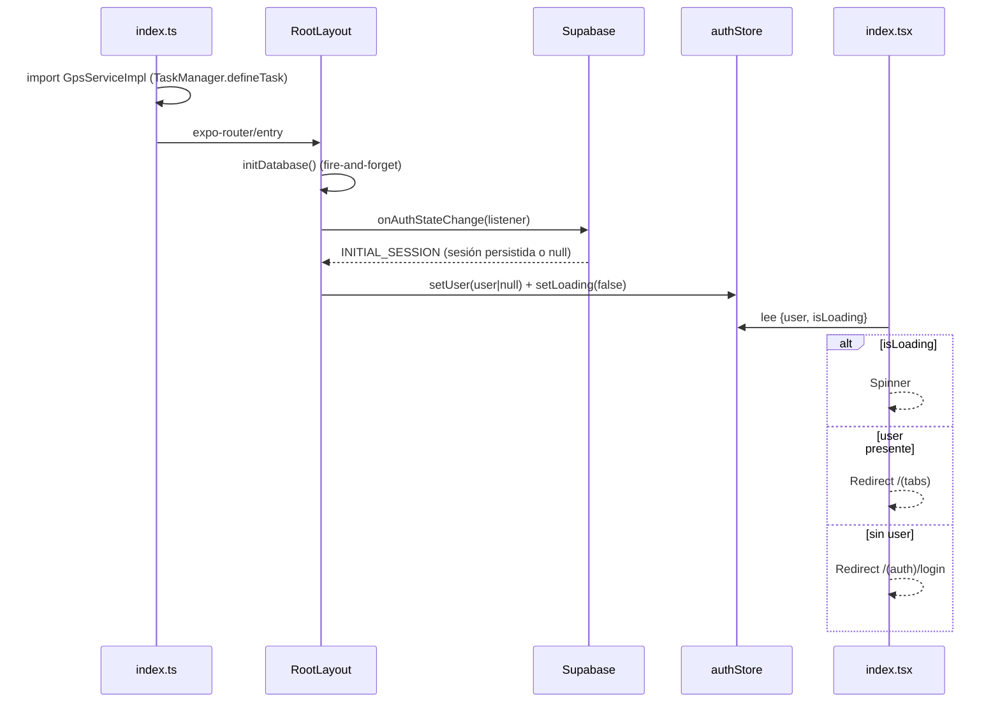
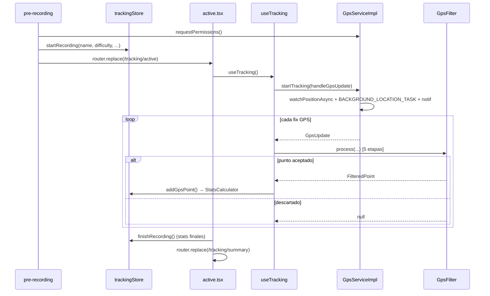
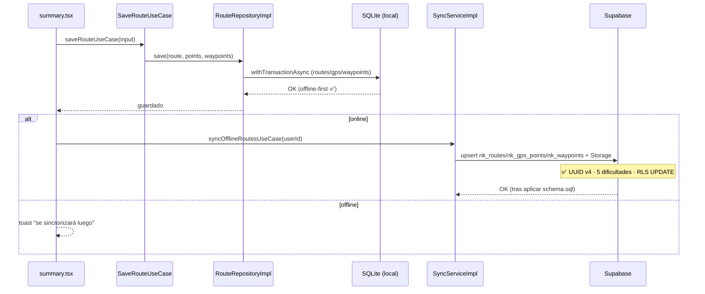
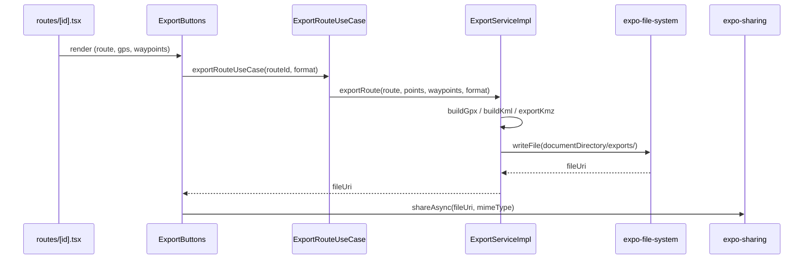

# Flujos de Ñan Kamay

> Documentación de los flujos **tal como están implementados** (no como deberían estar). Referencias `archivo:línea` verificadas.
> Para problemas conocidos de cada flujo, ver [`VALIDATION.md`](./VALIDATION.md).

Índice:
1. [Arranque y autenticación](#1-arranque-y-autenticación)
2. [Grabación GPS](#2-grabación-gps)
3. [Guardado y sincronización](#3-guardado-y-sincronización)
4. [Exportación](#4-exportación)

---

## 1. Arranque y autenticación

### Cómo funciona

El entry point es `index.ts` (no `expo-router/entry` directo): importa `GpsServiceImpl` **antes** que Expo Router para que `TaskManager.defineTask(BACKGROUND_LOCATION_TASK)` quede registrado al arrancar (`index.ts:3-6`).

El cliente Supabase es un singleton de módulo con sesión persistida en `expo-secure-store` (`supabaseClient.ts:6-19`, `autoRefreshToken: true`, `persistSession: true`).

El `RootLayout` (`src/app/_layout.tsx`) en su `useEffect` de montaje:
- Lanza `initDatabase()` **fire-and-forget** (`_layout.tsx:31`).
- Procesa deep links de confirmación de email (`Linking.getInitialURL` + listener `url`), parseando `#access_token`/`refresh_token` y llamando `supabase.auth.setSession(...)`.
- Suscribe `supabase.auth.onAuthStateChange(...)`: construye `User.fromProps(...)` desde `session.user` y lo escribe en `authStore` (`setUser` / `setLoading(false)`).

`src/app/index.tsx` redirige: `isLoading` → spinner; `user` → `/(tabs)`; sin user → `/(auth)/login`.

Login email: `login.tsx:25-38` valida campos → `supabase.auth.signInWithPassword(...)` → `router.replace('/(tabs)')`. En paralelo, el listener global rellena el store.

> ✅ **A4/A5 corregidos (2026-05-18).** Guard de auth reactivo en `(tabs)/_layout.tsx`. Google OAuth funcional vía `googleAuth.ts` (`expo-web-browser` + PKCE + `exchangeCodeForSession`) — requiere config en Supabase (provider Google + redirect `nan-kamay://auth-callback`).
> ⚠️ El flujo de auth sigue **sin Clean Architecture**: las pantallas llaman `supabase`/`googleAuth` directamente; `IAuthRepository` definido pero sin implementación (deuda arquitectónica, no funcional). Ver `ARCHITECTURE.md` §6.

### Diagrama

---

## 2. Grabación GPS

### Cómo funciona

**Pre-recording** (`src/app/tracking/pre-recording.tsx`): formulario con `name`, `description`, `difficulty` (5 niveles), `activityType`. `handleStart` pide permisos vía el singleton `gpsService.requestPermissions()` y, si concede, llama `trackingStore.startRecording(...)` + `router.replace('/tracking/active')`.

**Active** (`src/app/tracking/active.tsx`) monta `useTracking()` y `useElapsedTime()`:

- `startRecording` (`trackingStore.ts:62-78`) genera `routeId`, fija `status='recording'`, `startedAt=now`, resetea puntos/stats.
- `useTracking` (`useTracking.ts:72-87`): cuando `status==='recording'` resetea el filtro y llama `gpsService.startTracking(handleGpsUpdate)`.
- `GpsServiceImpl.startTracking` abre `watchPositionAsync` (`Accuracy.BestForNavigation`, `distanceInterval:10`, `timeInterval:5000`), muestra notificación persistente y arranca `BACKGROUND_LOCATION_TASK` (sin `foregroundService` de expo-location, intencional por crash Android 12+).
- Cada update pasa por el **pipeline `GpsFilter`** (5 etapas):
  1. Gate de precisión (descarta `accuracy > 25 m`)
  2. Detección estacionaria (3 lecturas `< 0.5 m/s` → ancla posición)
  3. Kalman 1D (lat/lon siempre; alt si `altitudeAccuracy ≤ 50`)
  4. Desplazamiento mínimo (`< 8 m` → descarta)
  5. Anti-teleport (`> 15 km/h` → descarta)
- Punto aceptado → `GpsPoint.create(...)` → `trackingStore.addGpsPoint` → recalcula `liveStats` con `StatsCalculator`.
- Notificación persistente actualizada cada 5 s (`useTracking.ts:106-131`).
- Pausa/reanudar acumula `totalPausedSeconds`.
- Waypoints: `router.push('/tracking/waypoint')`; el selector de tipo usa estado a nivel de módulo (`waypointSelection.ts`) + `router.back()` + `useFocusEffect` para no perder el formulario.
- Finalizar: `handleStop` → `Alert` → `finishRecording()` (recalcula stats finales) → `router.replace('/tracking/summary')`.

> ✅ **Corregido (2026-05-18).** El tipo de waypoint y `activityType` ya se persisten (C3/C4). El GPS se detiene explícitamente al finalizar (A2). La ruta es un **borrador en SQLite** desde el inicio: puntos/waypoints se guardan incrementalmente y el `BACKGROUND_LOCATION_TASK` escribe directo a SQLite si el proceso es revivido headless; al reabrir, Home ofrece Reanudar/Finalizar/Descartar (A3). Ver `VALIDATION.md`.

### Diagrama

---

## 3. Guardado y sincronización

### Cómo funciona (offline-first)

**Summary** (`src/app/tracking/summary.tsx`): consume `liveStats` (ya recalculado por `finishRecording`), permite toggle público, y al guardar:

1. `saveRouteUseCase(input)` → valida `gpsPoints.length>0`, crea `Route.fromProps({isSynced:false,...})`, delega a `routeRepository.save`.
2. `RouteRepositoryImpl.save` ejecuta **una transacción** `db.withTransactionAsync`: `INSERT OR REPLACE` ruta → `gps_points` en lotes de 100 (`INSERT OR IGNORE`) → `waypoints` (`INSERT OR REPLACE`).
3. `routesStore.addRoute(route)` lo inserta al tope de la lista.
4. Si hay red: dispara `syncOfflineRoutesUseCase(user.id)` **fire-and-forget**; si offline, toast informativo.

**Sync** (`SyncServiceImpl.syncOfflineRoutes`): por cada ruta no sincronizada, en `try/catch` individual: `upsert` ruta → `gps_points` (lotes de 500) → por waypoint: subir imágenes a Supabase Storage (`ImageUploadService`, base64) + `upsert` waypoint + filas `waypoint_images` → `markAsSynced`.

**Home** (`src/app/(tabs)/index.tsx`): `FlatList` + pull-to-refresh (`fetchRoutes`), `OfflineBanner`, badge "N sin sync", auto-sync al volver online (`useEffect [isOffline]`), borrado optimista.

> ✅ **Corregido (2026-05-18).** El sync remoto usa tablas `nk_*` (DB compartida), IDs UUID v4, 5 dificultades y RLS con UPDATE. `activityType` y `waypoint.type` ahora persisten. Requiere aplicar `supabase/schema.sql`. Pendiente: sync bidireccional / imágenes idempotentes (§A6, §A8). Ver `VALIDATION.md` (banner de actualización).

### Diagrama

---

## 4. Exportación

### Cómo funciona

`src/app/routes/[id].tsx` carga route/gps/waypoints desde `routeRepository` y renderiza stats grid, `RouteMap` estático, `ElevationChart` y `ExportButtons`.

`ExportButtons.tsx` ofrece GPX/KML/KMZ; al pulsar llama `exportRouteUseCase(routeId, format)`:

- `ExportRouteUseCase` obtiene la ruta + puntos + waypoints y delega en `exportService`.
- `ExportServiceImpl`:
  - **GPX 1.1**: `<metadata>`, `<wpt>` por waypoint, `<trk><trkseg>` con `<trkpt>` (ele, time, `<extensions><speed>`).
  - **KML 2.2**: `<Document>` con estilos, `<Placemark>` por waypoint y un `<LineString>` `clampToGround`.
  - **KMZ**: ZIP (JSZip) con `doc.kml` + carpeta `images/` (solo URIs locales, base64).
  - Escribe en `documentDirectory/exports/` (`expo-file-system/legacy`).
- El archivo se comparte con `expo-sharing` (`shareAsync` con `mimeType`/`UTI` por formato).

> ⚠️ El KMZ embebe imágenes pero el KML **no las referencia** (`VALIDATION.md` §M5). Sin escape de caracteres de control ni validación de coordenadas (§M6).

### Diagrama

